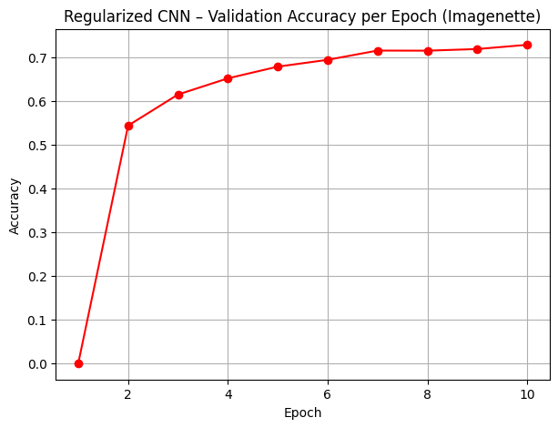
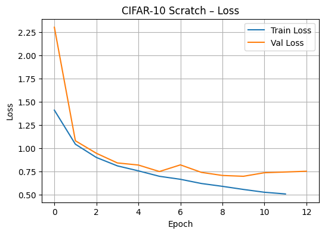
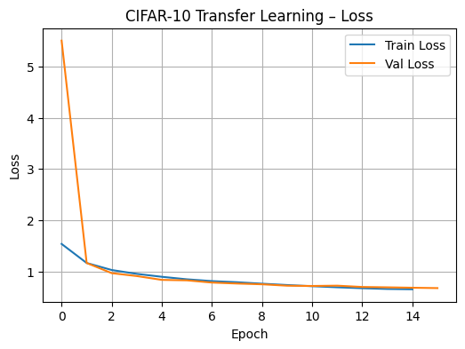
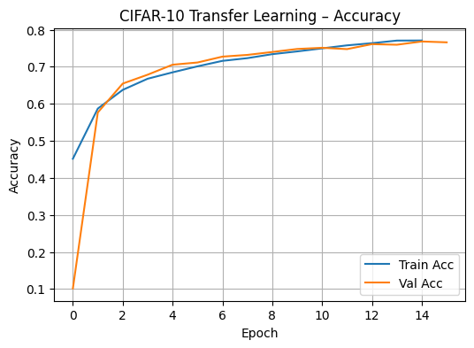

## 📊 Results
Results & Analysis

🔹 Imagenette – Regularized CNN

The regularized CNN model demonstrated improved generalization compared to the baseline network.
Validation accuracy stabilized around 73%, showing reduced overfitting and smoother convergence across epochs.

Key observations:

Training and validation curves remain closer compared to the non-regularized version

Reduced validation loss volatility

Improved validation accuracy over baseline (~66% → ~73%)

This confirms the effectiveness of data augmentation and regularization techniques in improving model robustness.

🔹 CIFAR-10 – Training from Scratch

When training the CNN from scratch on CIFAR-10:

Final test accuracy reached approximately 75%

Validation loss decreased steadily across epochs

Convergence required more training time compared to transfer learning

This serves as the baseline performance for comparison with transfer learning.

🔹 CIFAR-10 – Transfer Learning (Imagenette → CIFAR-10)

Fine-tuning the Imagenette-pretrained model on CIFAR-10 resulted in:

Final test accuracy of approximately 76.6%

Lower final validation loss compared to scratch training

Faster convergence during training

The pretrained convolutional layers provided meaningful feature representations, enabling the network to generalize better with fewer epochs.

🎯 Key Takeaways

Regularization significantly improved generalization performance.

Transfer learning outperformed training from scratch.

Pretrained features accelerated convergence and improved stability.

Even a lightweight CNN can achieve strong performance with proper training strategies.

### Imagenette – Regularized CNN

---

### CIFAR-10 – Training from Scratch

---

### CIFAR-10 – Transfer Learning

